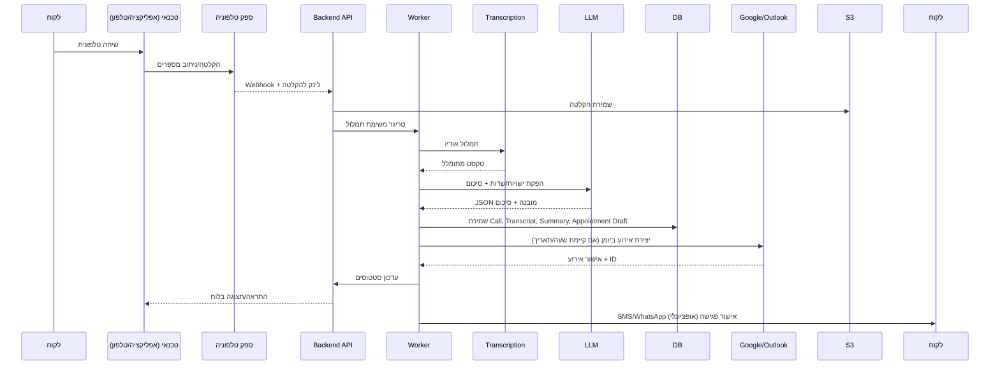

# SmartAgent Architecture

## Mermaid Diagrams

### Component Map
```mermaid
flowchart LR
  subgraph Client["Clients"]
    W[Web App (Next.js)]
    M[Mobile (React Native - אופציונלי)]
  end

  subgraph API["Backend API (FastAPI)"]
    Auth[Auth & Multi-Tenant]
    Calls[Calls & Uploads]
    NLP[LLM Orchestrator]
    Calendar[Calendar Integrations]
    Msg[SMS/WhatsApp]
    CRM[CRM & Scheduling]
    Webhooks[Webhooks (Telephony, Calendars)]
  end

  subgraph Worker["Async Workers (Celery/RQ)"]
    Transcribe[Transcription Jobs (Whisper/STT)]
    Extract[Info Extraction (LLM)]
    Notify[Notifications/Reminders]
    Sync[Calendar/CRM Sync]
  end

  subgraph Data["Data Layer"]
    PG[(PostgreSQL)]
    Redis[(Redis)]
    S3[(Object Storage - Recordings/Transcripts)]
  end

  subgraph Telephony["Telephony"]
    Twilio[Twilio/Vonage/Plivo]
  end

  subgraph Providers["External Providers"]
    GCal[Google Calendar]
    O365[Outlook/Office 365]
    WA[WhatsApp Business API]
    SMS[SMS Provider]
    Pay[Stripe/PayPal - אופציונלי]
  end

  W -->|HTTPS| API
  M -->|HTTPS| API

  API <--> PG
  API <--> Redis
  API <--> S3

  Calls --> Worker
  NLP --> Worker
  Worker --> S3
  Worker --> PG
  Worker --> Calendar
  Worker --> Msg

  Telephony -->|Webhook| Webhooks
  Webhooks --> Calls
  Calendar <--> GCal
  Calendar <--> O365
  Msg --> WA
  Msg --> SMS
```

### Sequence Diagram

